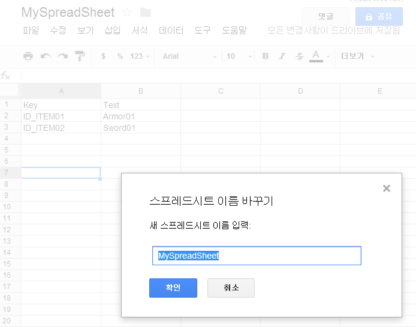
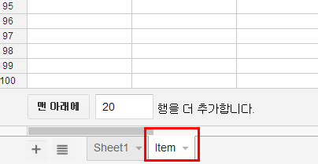
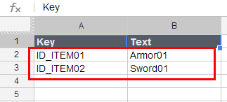
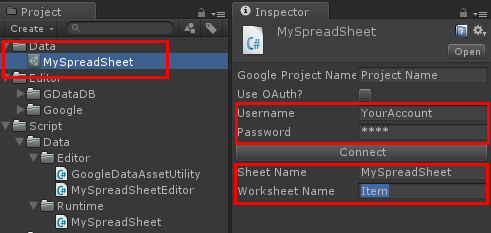
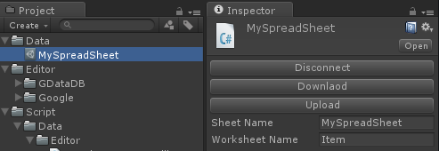
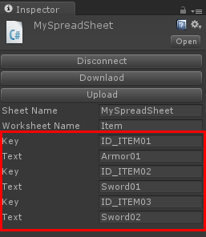

Unity-GoogleData
================

***IMPORTANT***  
OAuth 1.0 is no longer supported and disabled on May 5, 2015. which means Unity-GoogleData does not work without supporting OAuth 2.0.
See [Unity-QuickSheet](https://github.com/kimsama/Unity-QuickSheet) instead of using this package. [Unity-QuickSheet](https://github.com/kimsama/Unity-QuickSheet) supports not only Google data but also can get data from Excel file even without writing single line of code!

Unity-GoogleData enables to use google spreadsheet data within Unity editor. With Unity-GoogleData, you can retrieve data from google spreadsheet or upload any changed data back to google spreadsheet. 

Features
--------
* It can create an empty google spreadsheet.
* It can retrieve data from google spreadsheet.
* It can upload data back to google spreadsheet. (not supported yet)
* No need to parse any retrieved data, it automatically serializes retrieved data to Unity3D's ScriptableObject.

Usage
-----

### Setting a Google Project

*NOTE*: It is no longer necessary to specify google project with GDataDB.

### Creating a Google SpreadSheet

This part of the document briefly shows how it works with the existing sample. If you need to know how to make your own class data for your googld spreadsheet, see the [Creating Your Own Unity3D ScriptableObject class](https://github.com/kimsama/Unity-GoogleData#creating-your-own-unity3d-scriptableobject-class) section.

First, you need to create a google spreadsheet on your Google Drive. Login your Google Drive with your google account and create a new spreadsheet.

Change the title of the created spreadsheet as *'MySpreadSheet'* like the following:

Next, create a new worksheet and rename it to whatever you want to as the following image shows:

Now, it needs to edit cells for spreadsheet. Insert *'Key'* and *'Text'* at the first row of the created worksheet as like that:

**IMPORTANT**  
Note that the first row should not contain any values which are used for your class members.

### Setting GoogleDataSetting Unity3D asset

Open Unity3D editor and select *MySpreadSheet* asset file on the project view. 

Next, you need to specify the google account and password then insert spreadsheet and worksheet name for *Sheet Name* and *Worksheet Name* text field. 

Then press *Connect* button and it shows the following if it is successfuly connected to the spreadsheet.

Now, press *Download* button and it will retrieve all data from the specified worksheet and properly reflects all the data on the Unity's Inspector view.

### Creating Your Own Unity3D ScriptableObject class

First, you need to define a data class which represents google worksheet. As the following code, if you have two colums, *Key* and *Text* you also need to define two member fields and properties for that. 
Note that Unity only can serialize non static member fields([See the reference](http://docs.unity3d.com/Documentation/ScriptReference/SerializeField.html)) so the member fields are needed for a serialization and the properties which have *[ExposeProperty]* attribute are needed to be relfected its value on a Unity's inspector view.

    [System.Serializable]
    public class MyData
    {
	    [SerializeField]
	    string key;
	
	    [SerializeField]
	    string text;
	
	    [ExposeProperty]
	    public string Key	{ get {return key; } set { key = value;} }
	
	    [ExposeProperty]
	    public string Text	{ get { return text;} set { text = value;} }	
    }

Next, you need a ScriptableObject derived class which serializes data from google spreadsheet to Unity Editor. Note that whenever Unity builds it calls component's OnEnable() so it is reinitialized even the data already has all its values. Not to this happen, it should be checked that only it is initialized in the case of the data is null, mostly on its first time downloading from google spreadsheet. 

	public class MySpreadSheet : ScriptableObject 
	{
	    [HideInInspector] [SerializeField] 
	    public string sheetName = "";
	
	    [HideInInspector] [SerializeField] 
	    public string worksheetName = "";
	
	    [ExposeProperty]
	    public string SheetName 
	    {
		    get { return sheetName; }
		    set { sheetName = value;}
	    }
	
	    [ExposeProperty]
	    public string WorksheetName
	    {
		    get { return worksheetName; }
		    set { worksheetName = value;}
	    }		

		public MyData[] dataArray;
		
	    void OnEnable()
	    {		
	    	// IMPORTANT!
		    if (dataArray == null)
		        dataArray = new MyData[0];
	    }
	    ...
	}

You also need to write editor script to reflect all retrieved data on a Unity's inspector view. Create a new editor script file in any Editor folder. It needs to override three member functions: *OnEnable*, *OnInspectorGUI* and *Load* are that.

In the *OnEnable* method, we need to gether all properties of our serializable data class to reflect all its value on a Unity's inspector view after retrieving that from google spreadsheet.

	[CustomEditor(typeof(MySpreadSheet))]
	public class MySpreadSheetEditor  : BaseEditor<MySpreadSheet>
	{
		public override void OnEnable()
		{
			base.OnEnable();
			
			MySpreadSheet data = target as MySpreadSheet;
			
			databaseFields = ExposeProperties.GetProperties(data);
			
			foreach(MyData e in data.dataArray)
			{
			    dataFields = ExposeProperties.GetProperties(e);
				pInfoList.Add(dataFields);
			}
		}
		

Within *OnInspectorGUI*, all data which are retrieved are properly drawn on the inspector view of Unity Editor.

		public override void OnInspectorGUI()
		{
			base.OnInspectorGUI();
			
			if (GUI.changed)
			{
				pInfoList.Clear();
				
				MySpreadSheet data = target as MySpreadSheet;
				foreach(MyData e in data.dataArray)
				{
					dataFields = ExposeProperties.GetProperties(e);
					pInfoList.Add(dataFields);
				}
				
				EditorUtility.SetDirty(target);
				Repaint();
			}
		}
		

When you press *Download* button, overrided *Load* member function is called. So it's the place actually a database object is created and all data are retrieved from the google spreadsheet.

		public override bool Load()
		{
		    if (!base.Load())
			    return false;
		
		    MySpreadSheet targetData = target as MySpreadSheet;			

			var client = new DatabaseClient(username, password);		
			var db = client.GetDatabase(targetData.SheetName) ?? client.CreateDatabase(targetData.SheetName);	
			var table = db.GetTable<MyData>(targetData.WorksheetName) ?? db.CreateTable<MyData>(targetData.WorksheetName);
			
			List<MyData> myDataList = new List<MyData>();
			
			var all = table.FindAll();						
			foreach(var elem in all)
			{
				MyData data = new MyData();
				
				data = Cloner.DeepCopy<MyData>(elem.Element);
				myDataList.Add(data);
			}
						
			targetData.dataArray = myDataList.ToArray();
			
			EditorUtility.SetDirty(mySpreadSheet);
			AssetDatabase.SaveAssets();
			
			return true;
		}
	}

Last, write an editor script which makes a menu item for creating newly defined scriptable object. (See Assets/Script/Data/Editor/GoogleDataAssetUtility.cs file.) Whenever you add a new ScriptableObject derived class, you also need to add a new method which creates a new ScriptableObject derived class instance.

	public static class GoogleDataAssetUtility
	{
		[MenuItem("Assets/Create/GoogleData/MySpreadSheet")]
		public static void CreateGoogleDataTestSphreadSheetAsset()
		{
			CustomAssetUtility.CreateAsset<MySpreadSheet>();
		}
		
	}

Note
---------
If you met an error which is shown as an invalid credentials when you try to get data by clicking 'download' button, check that your google accout page and you have two-stage verification.

If you have Google two-stage verification on, then it doesn't matter what your Google password is, it won't be accepted. You need to generate (on Google) what is called an Application Specific Password (ASP). Go to [Google Account Page](https://www.google.com/settings/account) and set up an ASP, enter the password you generate as the password in your code, and you're done.

Limitations
-----------

* ScritableObject does not allow to save data changed on runtime. So if you need to serialize and save things that changes on runtime, you need to look at other methods of serialization such as JSON, BSON or XML, depending on your platform and/or requirements.

* Unity-GoogleData does not work in the Unity web player's security sandbox. You should change the *Platform* to *'Stand Alone'* or something else such as *'iOS'* or *'Android'* platform in the ***Build Setting***.

Todo
-------

References
----------
* [Unity Serialization](http://forum.unity3d.com/threads/155352-Serialization-Best-Practices-Megapost) on Unity's forum for details of serialization mechanism.
* [GDataDB](https://github.com/mausch/GDataDB) is used to retrieve data from Google Spreadsheet. Note that [GDataDB](https://github.com/mausch/GDataDB) is slightly modified to support *enum* type.
* [ExposeProperties](http://wiki.unity3d.com/index.php/Expose_properties_in_inspector) is used to easily expose variables of spreadsheet on the Unity3D's inspector view and let [GDataDB](https://github.com/mausch/GDataDB) access through get/set accessors.

License
-------

This code is distributed under the terms and conditions of the MIT license.

Copyright (c) 2013 Kim, Hyoun Woo
